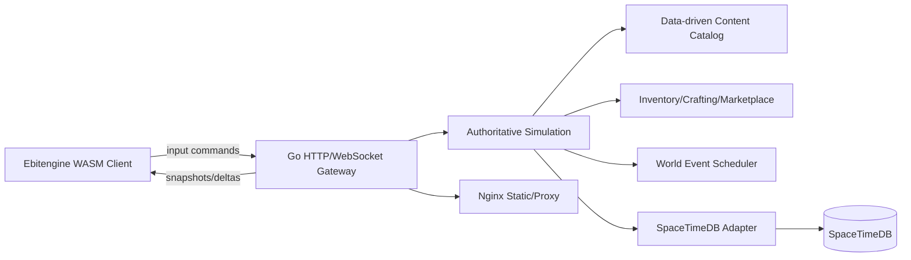

# Packov

Packov is a browser-first multiplayer extraction shooter foundation built around a server-authoritative Go simulation, Ebitengine/WebAssembly client, SpaceTimeDB persistence boundary, and data-driven live-service content.

The current implementation is intentionally geometric and systems-oriented: ships, enemies, bosses, loot, quests, events, crafting, marketplace listings, and extraction rules all flow through shared simulation packages used by the backend and frontend.

## Quick Start

```bash
make test
make server
```

Open `http://localhost:8080` after the server starts.

For WebAssembly output:

```bash
make wasm
```

For the Ebitdock browser feedback loop:

```bash
make ebitdock-doctor
make ebitdock
```

Ebitdock serves the Go/Ebitengine WASM client from `web/` on `http://localhost:8093` and uses dashboard port `8094`. `ebitdock doctor` currently warns that the HTML shell does not use its auto-reload hooks yet.

For the full local stack:

```bash
docker compose up --build
```

## Architecture



The simulation is deterministic where practical: fixed ticks, seeded procedural planets, data-driven stat blocks, explicit reducer-style commands, and server-owned entity state. Clients only send input intentions.

## Project Layout

```text
cmd/client              Ebitengine WebAssembly client
cmd/server              Go authoritative gateway
internal/game           Shared simulation/domain systems
internal/server         Networking, sessions, matchmaking, persistence adapter
content                 JSON gameplay content
spacetime               SpaceTimeDB schema and reducer contract docs
web                     Browser shell and generated wasm target
ebitdock.yaml           Ebitdock WASM development shell config
deploy/nginx            Nginx deployment config
docs                    Architecture, schemas, roadmap, live-service plans
```

## Implemented Systems

- Server-authoritative fixed-tick combat simulation.
- WASD/mouse twin-stick controls in Ebitengine.
- Geometric renderer with trails, bullets, loot, boss modules, extraction zone, and UI panels.
- Weapons, abilities, loot, crafting, planets, enemies, bosses, and events loaded from JSON.
- Procedural planet generation with hazards, resources, objectives, and extraction points.
- Inventory, carried loot, extraction failure rules, crafting recipes, and marketplace models.
- Boss and enemy AI with mechanics rather than only large health pools.
- Party matchmaking and reconnect/session state model.
- SpaceTimeDB SQL schema plus adapter interface for persistence/event sourcing.
- Docker Compose with Go server, SpaceTimeDB, and Nginx.

## Design Principle

There is no vertical stat treadmill. Unlocks expand tactical choices, biomes, abilities, cosmetics, and crafting paths. Combat-relevant upgrades are budgeted sidegrades so skilled play remains decisive.
