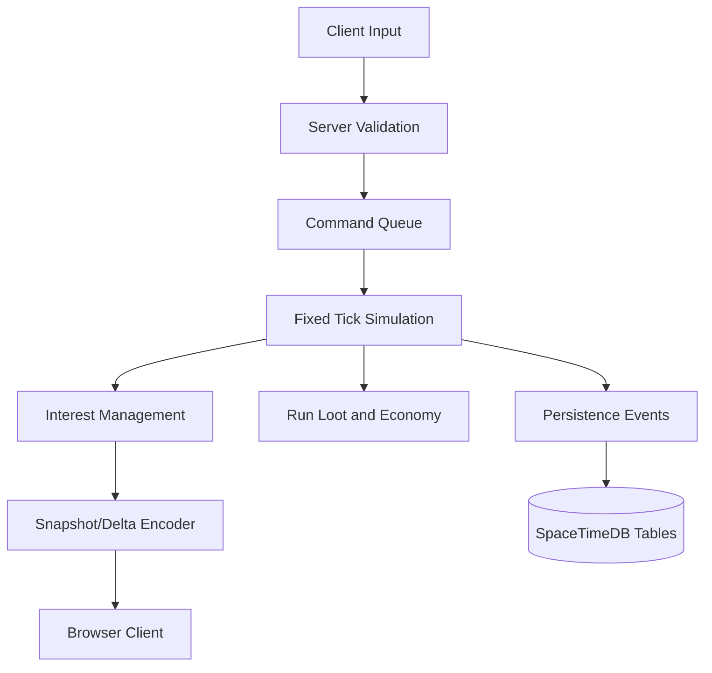

# Architecture

Packov is organized around a shared deterministic-ish simulation core and thin adapters around it.

## Subsystems

- Simulation: `internal/game` owns movement, combat, extraction, loot drops, boss phases, enemy AI, procedural planets, live events, crafting, and matchmaking models.
- Backend: `internal/server` owns WebSocket sessions, matchmaking orchestration, snapshots, reconnect state, and the SpaceTimeDB adapter boundary.
- Frontend: `cmd/client` owns input, camera, primitive rendering, trails, effects, and HUD. It uses the shared sim for local play and can consume server snapshots.
- Content: `content/game.json` owns weapons, abilities, enemies, bosses, loot, recipes, planets, and world event definitions.
- Deployment: Docker Compose starts SpaceTimeDB, the Go server, and Nginx.

## Authority Model

Clients send intentions only: movement vector, aim point, fire, ability, extraction, and marketplace/crafting commands. The server validates loadout unlocks, cooldowns, proximity, inventory, and market ownership before mutating state.

## Bandwidth Model

The current gateway emits full snapshots to keep the foundation clear. The next production step is replacing `ServerMessage{Snapshot}` with per-player deltas:

- Quantized positions and velocities.
- Entity create/update/delete streams.
- Interest windows around party members and objectives.
- Reliable event channel for inventory, marketplace, chat, and extraction outcomes.

## Progression Model

Unlocks are horizontal. New weapons, hulls, drones, and modules create tactical choices with stat budgets, tradeoffs, and encounter counters. Persistent progression survives failed extraction, but carried run loot does not.

## Economy Model

Everything valuable originates from gameplay: extracted loot, boss components, blueprints, trophies, cosmetics, and event materials. Credits are the exchange currency. Premium purchases are cosmetics only and never appear in combat calculations.
