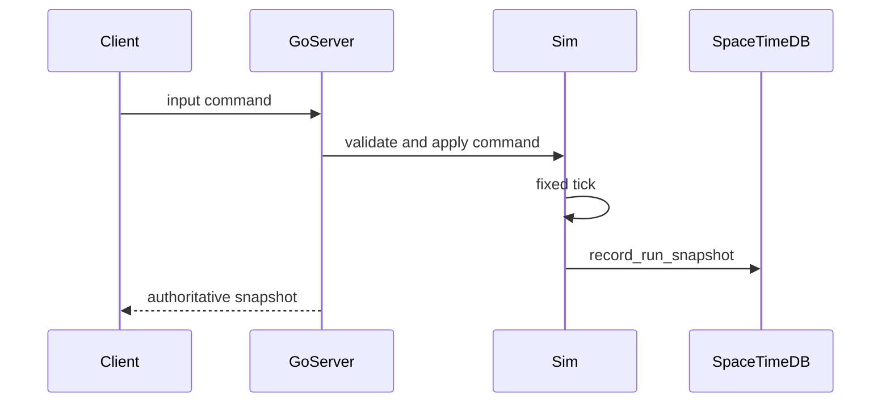

# SpaceTimeDB Reducer Contract

The Go server currently owns real-time combat authority and writes through `internal/server.Persistence`. A native SpaceTimeDB module should expose reducer names matching this contract so generated bindings can replace the fallback adapter.

## Reducers

- `upsert_player_account(player_id, display_name)`
- `save_inventory_stack(player_id, item_id, quantity)`
- `create_run(run_id, planet_id, seed)`
- `join_run(run_id, player_id, loadout_json)`
- `record_entity_snapshot(run_id, tick, entity_json_batch)`
- `complete_run(run_id, player_results_json)`
- `create_market_listing(listing_id, seller_id, item_id, quantity, unit_price, expires_utc)`
- `buy_market_listing(listing_id, buyer_id, quantity)`
- `create_guild(guild_id, founder_id, name)`
- `send_chat_message(message_id, channel, sender_id, guild_id, body)`
- `publish_world_event(event_instance_id, event_id, planet_id, starts_utc, ends_utc)`
- `update_community_progress(event_instance_id, contribution)`

## Security

All reducers derive caller identity from SpaceTimeDB auth context where possible. Client-supplied `player_id` is only accepted from the Go bridge service account or for local development.
